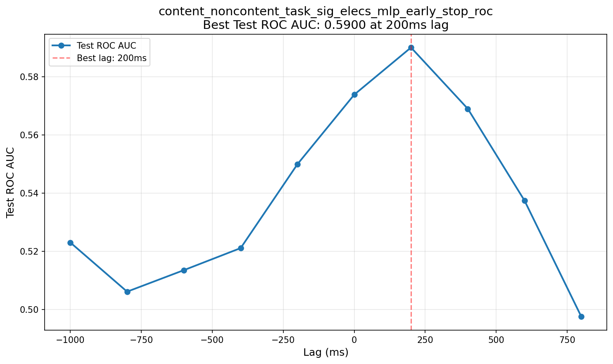
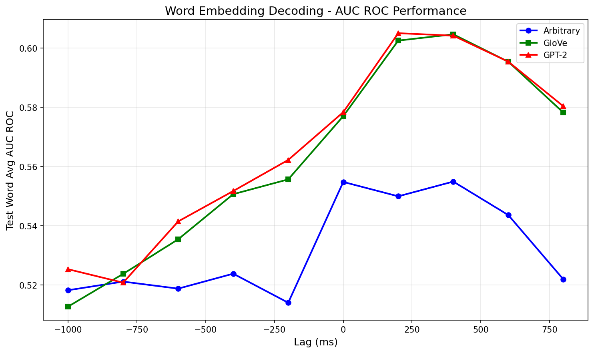
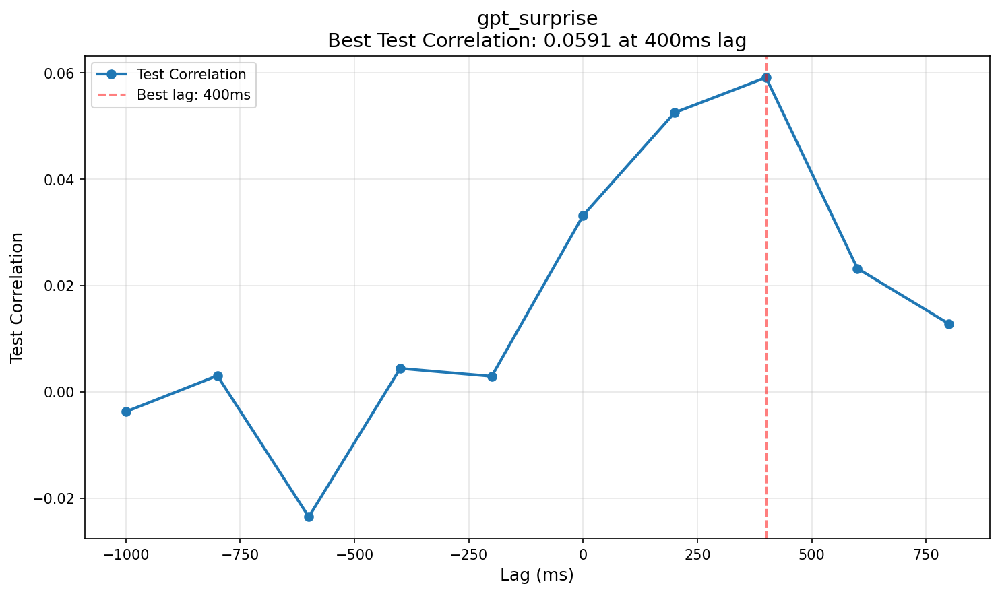
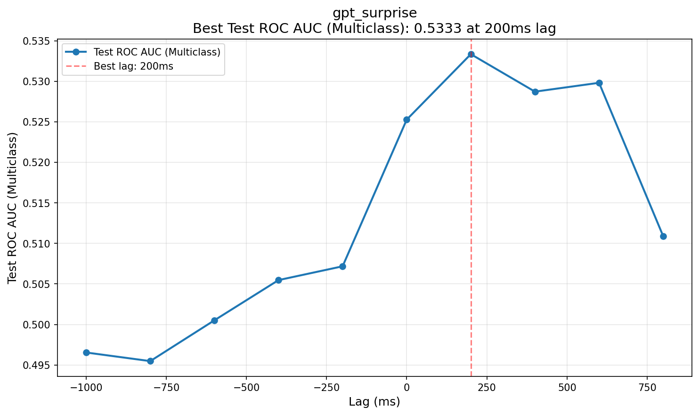
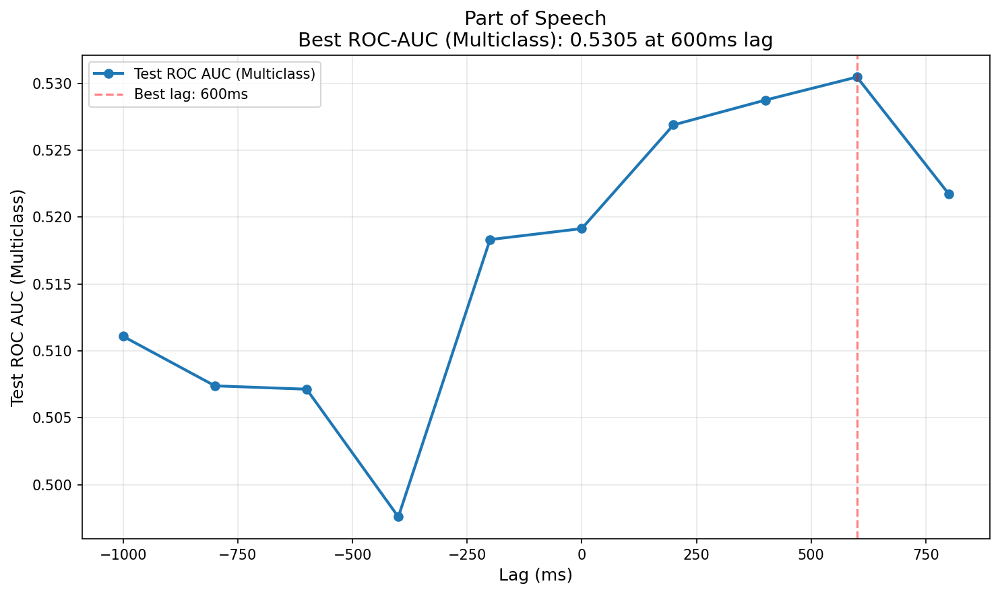
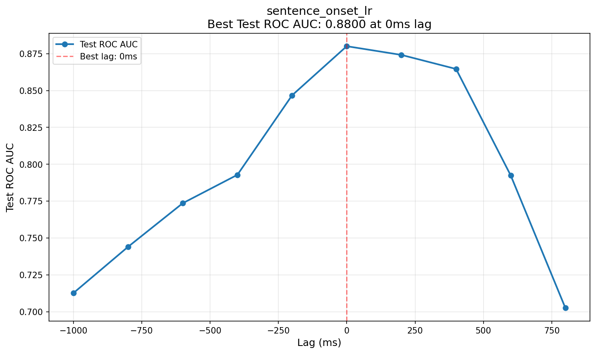

# Baseline Results Summary

This page summarizes the baseline results for all tasks in the podcast benchmark.

## Overview

Baseline results for all of our tasks using a simple deep network, trained only on our data.

**Note:** For detailed metrics across all lags, see the `lag_performance.csv` file in each task's results directory linked below.

## Content/Non-Content Classification

**Config:** `configs/neural_conv_decoder/neural_conv_decoder_content_noncontent.yml`

**Detailed Results:** [`baseline-results/content_noncontent_task_sig_elecs_mlp_early_stop_roc_2025-12-19-00-34-17/lag_performance.csv`](../baseline-results/content_noncontent_task_sig_elecs_mlp_early_stop_roc_2025-12-19-00-34-17/lag_performance.csv)

**Best Performance:**

- **Lag:** 200ms
- **ROC-AUC:** 0.5900

---

## Word Embedding Decoding

### Performance Across Lags

### Best Performance by Model

#### Arbitrary

**Config:** `configs/neural_conv_decoder/neural_conv_decoder_arbitrary.yml`

**Detailed Results:** [`baseline-results/ensemble_model_10_arbitrary_2025-12-19-00-17-32/lag_performance.csv`](../baseline-results/ensemble_model_10_arbitrary_2025-12-19-00-17-32/lag_performance.csv)

**Best Performance:**

- **Lag:** 400ms
- **AUC-ROC:** 0.5549

#### GloVe

**Config:** `configs/neural_conv_decoder/neural_conv_decoder_glove.yml`

**Detailed Results:** [`baseline-results/ensemble_model_10_glove_2025-12-19-00-17-41/lag_performance.csv`](../baseline-results/ensemble_model_10_glove_2025-12-19-00-17-41/lag_performance.csv)

**Best Performance:**

- **Lag:** 400ms
- **AUC-ROC:** 0.6046

#### GPT-2

**Config:** `configs/neural_conv_decoder/neural_conv_decoder_gpt2.yml`

**Detailed Results:** [`baseline-results/ensemble_model_10_gpt2_2025-12-19-00-17-43/lag_performance.csv`](../baseline-results/ensemble_model_10_gpt2_2025-12-19-00-17-43/lag_performance.csv)

**Best Performance:**

- **Lag:** 400ms
- **AUC-ROC:** 0.6057

---

## GPT Surprisal (Regression)

**Config:** `configs/neural_conv_decoder/neural_conv_decoder_gpt_surprise.yml`

**Detailed Results:** [`baseline-results/gpt_surprise_2025-12-19-00-18-44/lag_performance.csv`](../baseline-results/gpt_surprise_2025-12-19-00-18-44/lag_performance.csv)

**Best Performance:**

- **Lag:** 400ms
- **Correlation:** 0.0591

---

## GPT Surprisal (Multiclass)

**Config:** `configs/neural_conv_decoder/neural_conv_decoder_gpt_surprise_multiclass.yml`

**Detailed Results:** [`baseline-results/gpt_surprise_2025-12-19-00-18-43/lag_performance.csv`](../baseline-results/gpt_surprise_2025-12-19-00-18-43/lag_performance.csv)

**Best Performance:**

- **Lag:** 200ms
- **ROC-AUC (Multiclass):** 0.5333

---

## Part of Speech

**Config:** `configs/neural_conv_decoder/neural_conv_decoder_pos.yml`

**Detailed Results:** [`baseline-results/pos_task_sig_elecs_without_other_classes_2025-12-19-00-34-17/lag_performance.csv`](../baseline-results/pos_task_sig_elecs_without_other_classes_2025-12-19-00-34-17/lag_performance.csv)

**Best Performance:**

- **Lag:** 600ms
- **ROC-AUC (Multiclass):** 0.5305

---

## Sentence Onset Detection

**Config:** `configs/neural_conv_decoder/neural_conv_decoder_sentence_onset.yml`

**Detailed Results:** [`baseline-results/sentence_onset_lr_2025-12-19-00-18-44/lag_performance.csv`](../baseline-results/sentence_onset_lr_2025-12-19-00-18-44/lag_performance.csv)

**Best Performance:**

- **Lag:** 0ms
- **ROC-AUC:** 0.8800

---

## Volume Level Prediction

**Config:** `configs/time_pooling_model/simple_model.yml`

**Detailed Results:** [`baseline-results/volume_level_simple_2025-12-19-00-34-56/lag_performance.csv`](../baseline-results/volume_level_simple_2025-12-19-00-34-56/lag_performance.csv)

**Best Performance:**

- **Lag:** 200ms
- **Correlation:** 0.4479

---

<!--
This file is manually maintained.
To regenerate plots only, run: python scripts/generate_baseline_plots.py
-->
